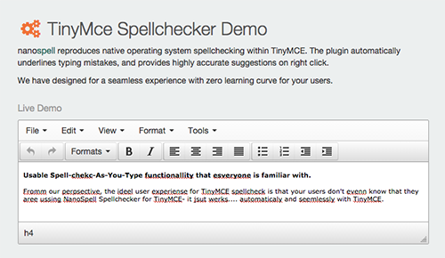

# TinyMce Spellchecker Demo

Source Code &amp; Examples the popular TinyMce Spellchecker plugin by NanoSpell. (http://tinymcespellcheck.com)

The repo contains source code and examples for using the "tinymce spellchecker" plugin by nanospell.

This allows for TinyMce developers to grow a knowledges base for different installation types for TinyMce users who want to install domain wide spellchecking to Tinymce Editor.   Nanospell is becoming popular, and we want to be able to make easy installation and community feedback part of out plan for 2016 and onwards.

## What is "TinyMce Spellcheck" by NanoSpell?

NanoSpell TinyMce Spellchecking plugin adds inline spellchecker capabilities to TinyMce editor.

It does all spellchecking locally on your server using AJAX handlers - so your data is never sent off site.  This feature has made the software popular with SAAS and Intranet developers on Linux, Windows and Apple platforms.

## What is "TinyMce"

TinyMce is a popular, free HTML editing plugin for websites, developed in JavaScript.  It is ubiquitous, present in popular end user web applications such as wordpress.

## Why do we need a spell-checker plugin for "TinyMce"

TinyMce lacks a native spellchecker.  Although some older plugins exists, they are often found to be 'not working' or  'error general' and then fail.  Native browser spellchecking is also not an option, because TinyMce nessicarily needs to override the operatig syste, / browsers context menus to provide contextual (right-click) functionality.

## What is in this project ?
This project is a place to create tutirials and working examples of Nanospell''s spelling plugin for Tinymce.  
Although the plugin contains some closed source ajax handlers due to proprietary licensing, the examples and remainer are open sourced in acreement with the attached license.
This allows for community involvement and feedback in making  spellchecking for Tinymce stable, elegant and enjoyable for web devlopers.

##  "TinyMce Spellchecker" Specifications

Supported Languages and Platforms:
- C#
- Classic ASP
- VB.Net
- PHP
- Java

## Get Started with TinyMce Spellchecker

### Step 1 - Download the nanospell spellchecking plugin.
The nanospell plugin for tinymce is present in the project (nanospell folder), and also from http://tinymcespellcheck.com/downloads/nanospell.zip

### Step 2 - Test it 
Point your favourite web browser to /nanospell/getstarted.html 

getstarted.html contains an ajax/javascript app that  your install, gives step-by-step help if you are stuck, and provides personalized source code snippets.

### Step 3 - Get Coding

``tinymce.init({
..	
	external_plugins: {"nanospell": "/path/to/nanospell/plugin.js"},
	nanospell_server: "php" // choose "php" "asp" "asp.net" or "java"
..	
});``

Read more about:

Compatibility & Installation:  http://tinymcespellcheck.com/installation
Settings & Variables: http://tinymcespellcheck.com/settings

Download:
- NanoSpell spellchecker plugin for http://tinymcespellcheck.com/downloads/nanospell.zip
- 23 Free International Dictionaries: http://tinymcespellcheck.com/dictionaries

## Free Dictionaries

English Spellchecker Dictionaries for TinyMCE
- Global English "en"
- American English "en_us"
- Canadian English "en_ca"
- British English "en_uk"
- Australian English "en_au"

Specialist English Spellchecking Dictionaries For TinyMce
- International Medical English "en_med"
- International Legal English "en_legal"
- Scientific and Engineering English "en_sci"
 
International Spell checking Dictionaries For TinyMce
-  Afrikaans "af"
-  Brazilian Portuguese "pt_br"
-  Catalan "ca"
-  Danish "da"
-  Dutch (Nederlands) "nl"
-  Frisian "fris"
-  French "fr"
-  Gaelic "gaelic"
-  German "de"
-  Indonesian "id"
-  Italian "it"
-  Norwegian "no"
-  Malaysian "ms"
-  Portuguese (Portugal) "pt"
-  Spanish "es"
-  Swedish "se"

## Licensing

Nanospell offer a free-to-develop license for their users, who are typically web designers and web programmers.  Their is a pay-to-deploy model to license the technology for using in Enterpise, business systems and public/commercial website projects.  

Please note that nanospell for tinymce (the spellchecker plugin) is an independent  spellchecker-plugin project for the tinymce platform. We love TinyMCE which is copyright Moxicode Systems AB.  Nanospell is not officially  endorsed Moxicode in any way. This project, and its contents do not represent Moxicode.

